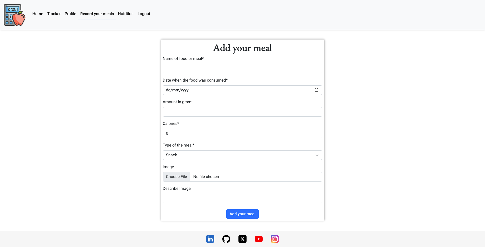

# CalorieCompass
## Overview
Welcome to CalorieCompass, your ultimate companion on the journey towards achieving your personal health and fitness goals. This innovative web application is designed to track your daily calorie intake, ensuring you stay on the right path to nutritional wellness.

CalorieCompass is not just a simple calorie counter. It's a comprehensive tool that provides an in-depth view of your eating habits, helping you understand more about your diet and how it affects your overall health. By logging your meals, you can easily monitor your intake of not just calories, but also essential nutrients - from proteins and carbs to vitamins and minerals.

The application is designed with user-friendly features that make it easy for you to log in your daily meals. All you need to do is input the food you've consumed, and CalorieCompass will calculate the calories for you. Whether you're eating out or cooking at home, we've got you covered with our extensive database of food items and their nutritional values.

## Project Goals
This is my fourth portfolio project for Code Institute and my goal with this project is to display my newly acquired skills with frameworks such as Bootstrap and Django. I decided to build a calorie tracker webapp that fetches the information from an API website

## Contents

## The Strategy Plane
CalorieCompass goal is to provide a comprehensive and user-friendly app that enables users to track their nutritional intake, understand the caloric and nutritional content of foods, and suggests activities to offset caloric intake. We want to become the go-to app for individuals looking to maintain a healthy diet, lose weight, or gain insight into their eating habits.

## The Ideal User
- Someone wants to track their caloric intake daily.
- Someone wants to know nutrition facts about the food they eat.
- Someone wants to track sports activities needed to burn the food they ate.

## Site Goals
- Provide users to create their own profile.
- Provide users to add their daily meals.
- Provide users an interface to know nutritional facts about food.
- Provide users a graphical representation of the macro nutrients food.
- Provide users a graphical representation of their caloric intake.

## Agile planning
This project was developed using agile methodologies by delivering small features across the duration of the project. All User Stories were assigned to Epics, prioritized under the labels, Must Have, Should Have and Could Have. They were assigned story points according to complexity. Story points were adjusted mid-project to use the common Fibonacci sequence correctly. "Must Have" stories were completed first, "Should Have's" and then finally "Could Have's".

The Kanban board was created using Github projects and can be located [here](https://github.com/users/moabdelbasset/projects/2/views/1) and can be viewed to see more information on the project cards. All stories have a full set of acceptance criteria to define the functionality that marks that story as complete.

## The Skeleton Plane
This is the prototype of the project that may change during its development. 

Wireframe Example

    

    

    

    

    

    

### Security

Views were secured where needed using the Django decorator @login_required. Access to the views using the @login_decorator can only be accessed by registered users. This means that if a user tries to access a view that is decorated with @login_required, but they are not currently logged in, they will be redirected to the login page instead.

Environment variables were stored in an env.py for local development for security purposes to ensure no secret keys, API keys, or sensitive information was added to the repository. In production, these variables were added to the Heroku config vars within the project.

## **The Scope Plane**

* Responsive Design - The site should be fully functional on all devices from 320px up
* Hamburger menu for mobile devices
* Home page describing the site and links to features for registered users

## **The Structure Plane**

### **Features**
`
As a User I would like to view the site on my different devices so that I can view the site on the go
`

**Navbar**

`
As a User I want to see a clear way of navigating the site so that I can find the information relative to my needs
`

The Navbar contains links for Home, Tracked food, Add meals, Nutrion page, and Profile pages.

The following navigation items are available on all pages:
  * Home - Visible to all but for logged in users it will give a summary of caloric intake in the last 7 days
  * Login - Visible to logged out users
  * Signup - Visible to logged out users
  * Tracker - Visible to logged in users
  * Profile -> profile.html - Visible to logged in users
  * Record your meals -> add_tracker.html - Visible to logged in users
  * Nutrition -> nutrition.html - Visible to logged in users
  * Logout -> logout.html - Visible to logged in users

The navigation menu is displayed on all pages and drops down into a hamburger menu on smaller devices. This will allow users to view the site from any device and not take up too much space on mobile devices. It is easily noticeable, intuitive, and easy to use.

  

**Footer**

`
As a User I want to be able to get in touch with the Developer so that I can enquire about issues/suggestions I may have
`

The footer is placed at the bottom of the page. The social media links are displayed with icons provided by Font Awesome. This is where the user can click on a social media link and reach out to the developer for news and updates. A link to the developer's Github repository is provided and displayed using the Font Awesome Github icon. These icons have aria labels added to ensure users with assistive screen reading technology know the purpose of the links. They also open new tabs as they lead users away from the site.

  

**Homepage**

There are two variations of the Home page that change based on User login/registration. Users that have not signed up will be met with a welcome message and some information about the site. Details of features available to registered Users are shown and a Sign-Up button is provided.

Users that have registered and logged in will be met with a similar layout but this time there will be buttons linking the user to various functions but they will land on a user dashboard that will display the user caloric consumption during the last seven days.

 

   

**Tracker Page**
`
As a User I want to have a section where I can view all my addead meals with the coresponding calories
`

The Tracker page has a similar layout to the Home page as the user can view all the added meals with the date and the calories.

   

`
As a User I want to edit the entered meals in the Tracker page
`

In the tracker page users can edit meals entered 

   

`
As a User I want to delete any entered meal in the Tracker page
`

In the tracker page users can delete meals entered 

**Profile**

`
As a User I would like access to my Profile so that I can upload an image or alter my details where needed
`

Profile features are only available to registered users.

When a user signs up to the site a Profile will automatically be created for them. They can access their Profile page from the Profile Navbar link. On the Profile page, the user can add/change information like their profile image, age and weight. Users can also upload their own Profile image and if they do not want to a default image is provided. 

   

**Record your meal**
`
As a User I would like record my meals
`

Record your meal is only available to registered users.

Users can add their meal and the app will calculate the amount of calories for this meal and will record it with the date choosed by the user

   

**Nutrition**
`
As a User I would like to search for nutritional facts for certain amount of food
`

Users can search for nutritional facts of the searched food. It can give warnings if some food has high of fats, calories or sugar. Also, It will view the nutritonal facts in a graphical representation and it will give the amount of effort needed to burn the amount of calories you will get from this food

   
   

**Error Pages**

**404 Page**

`
As a Developer I can implement a 404 error page so that I can alert users when they have accessed a page that doesn't exist
`

A 404 page has been implemented and will display if a user navigates to a broken link.

The 404 page will allow the user to easily navigate back to the main website if they direct to a broken link / missing page, without the need for the browser's back button.

**500 Page**

`
As a Developer I can implement a 500 error page so that I can alert users when an internal server error occurs
`

A 500 error page has been displayed to alert users when an internal server error occurs. The message relays to users that the problem is on our end, not theirs.

**Favicon**

A favicon has been added the website to enable users to easily locate the website in the browser when multiple tabs are open.

**Mobile**

`
As a User I would like to view the site on my different devices so that I can view the site on the go
`
   

### **Future Features**

**Creating a social network:** Ability for users to add other users as friends and see their progress.

**Track bodyweight:** Ability for users to track body weight.

**Talk to nutritionist:** Ability for a user to schedule a consultation sessions with a nutritionist.

## **The Surface Plane**

### **Design**

#### **Colour Scheme**

I opted for a very minimalistic aesthetic and the below 4 colours were chosen. I went for a lighter theme theme with a grey to add some contrast and vibrance to the site. The colours have been implemented across the site and are included in the buttons/links and their hover effects.

  

#### **Typography**

The Roboto font was used throughout the website. This font is from google fonts and was imported into the style sheet.

[Back to top &uarr;](#contents)

### **Frameworks and Tools Used**
1. [Django](https://www.djangoproject.com/)
    - Django was used as the main python framework in the development of this project
1. [Bootstrap](https://blog.getbootstrap.com/)
    - Bootstrap was used for general layout and spacing requirements for the site.
1. [APINinja](https://api-ninjas.com/api/nutrition)
    - The Nutrition API extracts nutrition information from text using natural language processing.
1. [Cloudinary](https://cloudinary.com/)
    - Cloudinary was used to store all static files and images
1. [Git](https://git-scm.com/)
    - Git was used for version control by utilizing the Gitpod terminal to commit to Git and Push to GitHub.
1. [GitHub:](https://github.com/)
    - GitHub is used to store the project's code after being pushed from Git.
1. [Heroku](https://www.heroku.com/)
    - Heroku was used to deploy the app.
1. [Balsamiq](https://balsamiq.com/)
    - Balsamiq was used to produce the sites wireframes
1. [XConvert](https://www.xconvert.com/)
    - XConvert was used to convert images to webp or png where required.
1. [Stackoverflow](https://stackoverflow.com/)
    - Stackoverflow was used on many occasions to figure out some troublesome code.
1. [CI Python Linter](https://pep8ci.herokuapp.com/)
    - I used CI Python Linter for the validation of the site's Python code.
1. [Grammarly](https://www.grammarly.com/)
    - Grammarly was used to check typography.

### **Libraries Used**

- asgiref - A standard Python library to allow for asynchronous web apps and servers to communicate with each other.
- cloudinary - A Python package allowing integration between the application and Cloudinary.
- coverage - is a third-party package that helps developers measure code coverage in their Python codebase.
- dj-database-url - A Django utility to utilise the DATABASE_URL environment variable to configure the Django application. Used with PostgreSQL.
- dj3-cloudinary-storage - A Django package that facilitates integration with Cloudinary storage.
- Django - A python package for the Django framework.
- django-active-link - A Django package used to highlight an active link in the site navigation bars.
- django-allauth - An integrated set of Django applications addressing user authentication, registration and account management.
- django-ckeditor - is a third-party package that provides a rich text editor widget for Django web applications.
- django-crispy-forms - A Django package that provides tags and filters to control the rendering behaviour of Django forms.
- django-js-asset - is a third-party package for Django that simplifies the process of including JavaScript assets in Django templates.
- django-richtextfield - is a third-party package for Django that provides a model field for rich text editing. 
- gunicorn - A Python WSGI HTTP Server for UNIX.
- oauthlib - A generic, spec-compliant, thorough implementation of the OAuth request-signing logic for Python 3.6+.
- psycopg2 - A PostgreSQL database adapter for Python.
- PyJWT - A Python library that allows for encoding and decoding of JSON Web Tokens (JWT).
- python3-openid - A set of Python packages to support use of the OpenID decentralized identity system.
- pytz - A Python package for world timezone definitions, modern and historical.
- requests-oauthlib - A Python package for OAuthlib authentication support for Requests.
- sqlparse - A non-validating SQL parser for Python.

[Back to top &uarr;](#contents)

## **Testing**
I have included details of testing both during development and post-development in a separate document called [Testing.md](Testing.md)

[Back to top &uarr;](#contents)

## **Deployment**

### **GitHub**

This project was developed by forking a specialized [Code Institute template](https://github.com/Code-Institute-Org/python-essentials-template) which simulates a terminal in the web browser. 

1. Click Use this template
2. Name the repository
3. Launch using the Gitpod web extension
4. Pin project in Gitpod workspaces

### **Version Control**

For version control the following steps were made:

For version control the following steps were made:

1. Changes made to files in Gitpod
2. Files made ready for commit with command - git add "filename", or git add . to add all files
3. For the commits the following command was run along with commit description - git commit -m "This is my commit etc"
4. To move the changes to Github the following command was run - git push
5. Alternatively files can be made ready for commit using the Source Control staging area in Gitpod
6. Files were staged and a message describing the commit was made before committing and pushing it to GitHub

### **Clone Repo**

Creating a clone enables you to make a copy of the repository at that point in time - this lets you run a copy of the project locally: This can be done by:

1. Navigating to https://github.com/moabdelbasset/Project4
2. Clicking on the arrow on the green code button at the top of the list of files
3. Select Local then HTTPS copy the URL it provides to the clipboard
4. Navigate to your code editor of choice and within the terminal change the directory to the location you want to clone the repository to.
5. Type 'git clone' and paste the HTTPS link you copied from GitHub
6. Press enter and git will clone the repository to your local machine

### **Forking the GitHub Repository**

By forking the GitHub Repository we make a copy of the original repository on our GitHub account to view and/or make changes without affecting the original repository by using the following steps...

1. Log in to GitHub and locate the repository [Project4](https://github.com/moabdelbasset/Project4)
2. At the top of the Repository (not the top of the page) just above the "Settings" Button on the menu, locate the "Fork" Button.
3. You should now have a copy of the original repository in your GitHub account.

### **Final Deployment with Heroku**

The below steps were followed to deploy this project to Heroku:
1. Go to [Heroku](https://dashboard.heroku.com/apps) and click "New" to create a new app.
2. After choosing the app name and setting the region, press "Create app".
3. Go to "Settings" and navigate to Config Vars, enter the below:
    - SECRET_KEY: (Enter your secret key)
    - DATABASE_URL: (Enter the database URL from ElephantSQL)
    - CLOUNDINARY_URL: (Enter Cloudinary API URL)
    - PORT: 8000
4. Leave "Settings" and go to "Deploy". Scroll down and set Deployment Method to GitHub.
Once GitHub is chosen, find your repository and connect it to Heroku.
5. Scroll down to Manual Deploy, make sure the "main" branch is selected, and click "Deploy Branch". 
6. The deployed app can be found [here](https://caloriecompass-f135054ab2fa.herokuapp.com/).

[Back to top &uarr;](#contents)

## **Credits**

1. [Code Institute Template](https://github.com/Code-Institute-Org/python-essentials-template)
    - This repository was created using the template provided by Code Institute. Also, without the knowledge gained through the coursework, I would not be able to create this site so thank you Code Institute.
1. [Django Documentation](https://docs.djangoproject.com/en/4.0/)
    - Thanks to the Django docs which were also used as a step-by-step while going through the project to ensure everything was set up correctly.
1. [Allauth Documentation](https://django-allauth.readthedocs.io/en/latest/faq.html)
    - Thanks to the Alluath documentation which was referenced during development.
1. [Daisy McGirr - Django Playlist](https://www.youtube.com/@IonaFrisbee)
    - Daisy channel helped me alot in understanding how Django projects work.
1. [Stackoverflow](https://stackoverflow.com/)
    - I found myself on Stackoverflow so many times researching issues. This a fantastic place to learn and troubleshoot code.
1. [Slack](https://slack.com/intl/en-ie/)
    - The slack community is great and I reached out to fellow students who had already completed their P4 for their advice and got some nice tips and feedback. I attending some webinars by CI staff which I found very beneficial.
1. [Youtube](https://www.youtube.com/)
    - Various videos were watched for further learning and Django project ideas. Some playlists I have reviewed are [Django Project: Movie App](https://www.youtube.com/watch?v=tm9Yps3IkmQ&list=PLBQzvdjNG8c-g_mVYUNiVDwwO5YgcbNwT), [Django IMDB clone](https://www.youtube.com/watch?v=FawGmAas4h0&list=PL9tgJISrBWc6ktmvTSLGrn055XzVb0OwZ&index=1)
1. Sean Finn
    - I reviewed the above Project 4 repo for inspiration on README layouts and testing.
